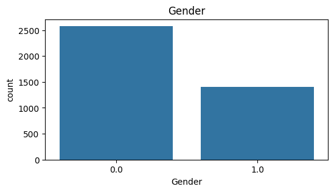
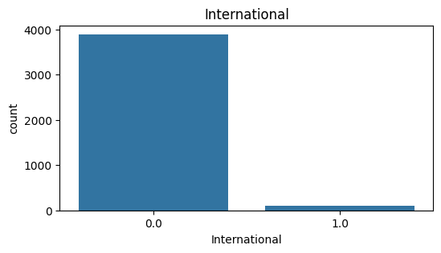
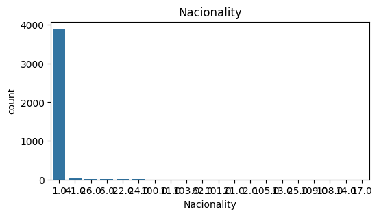
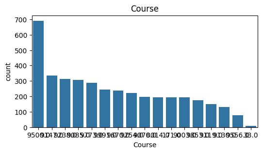
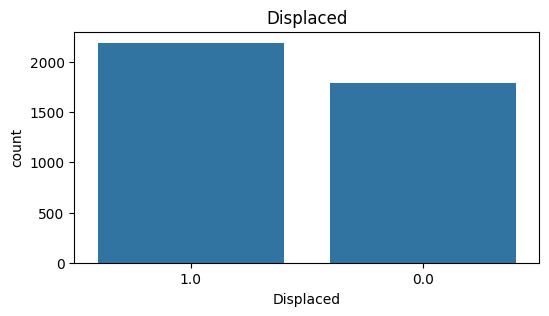
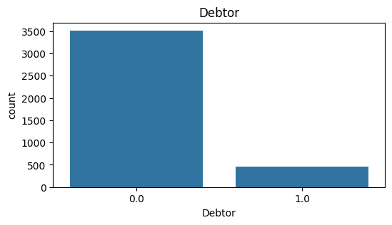
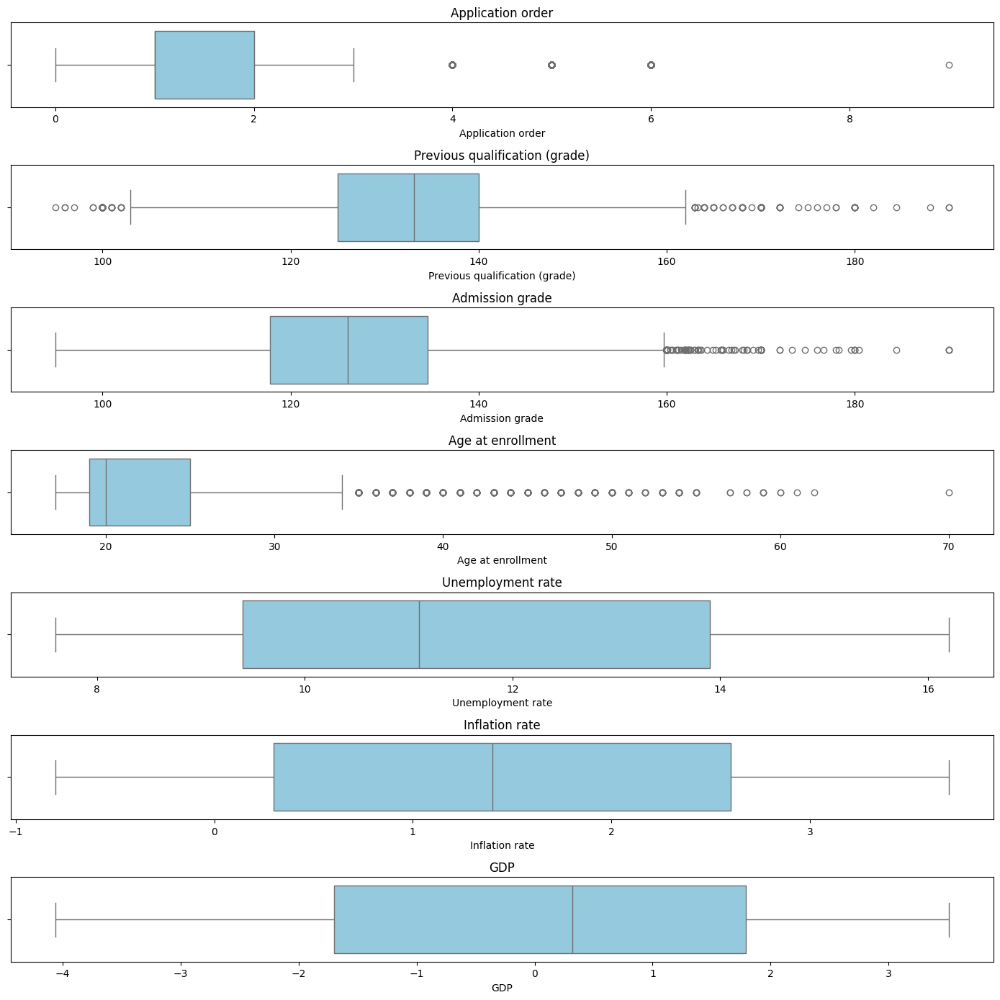

# Academic Success Prediction - CSE422 Project

## 📋 Project Overview

This project implements a comprehensive machine learning approach to predict academic success outcomes for students using various socio-economic, demographic, and academic features. The project was developed as part of CSE422 (Artificial Intelligence) coursework and employs multiple classification algorithms to predict whether a student will **Graduate**, **Dropout**, or remain **Enrolled**.

## 🎯 Objective

The primary goal is to develop and compare different machine learning models to accurately predict student academic outcomes, enabling educational institutions to:
- Identify at-risk students early
- Implement targeted intervention strategies
- Improve student retention rates
- Optimize resource allocation for student support services

## 📊 Dataset Description

### Dataset Overview
- **Source**: Academic Success Dataset
- **Total Records**: 4,424 student records
- **Features**: 24 predictor variables
- **Target Classes**: 3 categories (Graduate, Dropout, Enrolled)
- **File**: `academic_success_dataset.csv`

### Class Distribution


The dataset shows the distribution of target classes, providing insights into the balance of academic outcomes.

### Key Features
The dataset includes diverse features categorized as follows:

#### **Demographic Information**
- Marital status
- Gender
- Age at enrollment
- Nationality
- International student status






#### **Academic Background**
- Application mode and order
- Course information
- Previous qualification and grades
- Daytime/evening attendance
- Admission grade





#### **Family Background**
- Mother's and Father's qualifications
- Mother's and Father's occupations
- Educational special needs
- Displaced status




#### **Financial Factors**
- Debtor status
- Tuition fees up to date
- Scholarship holder status




#### **Economic Indicators**
- Unemployment rate
- Inflation rate
- GDP

#### **Target Variable**
- **Graduate**: Students who successfully completed their program
- **Dropout**: Students who left the program before completion
- **Enrolled**: Students currently active in the program

## 🔍 Exploratory Data Analysis

### Data Quality Analysis



### Feature Correlation Analysis


The correlation matrix reveals relationships between different features and helps identify potential multicollinearity issues.

## 🔬 Methodology

### Data Preprocessing
1. **Data Loading**: Import dataset using pandas
2. **Missing Value Analysis**: Identify and handle missing values
3. **Feature Engineering**: 
   - Label encoding for categorical variables
   - Feature scaling using StandardScaler
   - One-hot encoding for categorical features
4. **Data Splitting**: Train-test split (typically 80-20 ratio)

### Machine Learning Models Implemented

#### 1. **Neural Network (Deep Learning)**
- **Architecture**: Multi-layer perceptron with hidden layers
- **Framework**: TensorFlow/Keras with Scikit-learn wrapper
- **Features**: Dense layers with dropout for regularization
- **Activation**: ReLU for hidden layers, Softmax for output
- **Optimizer**: Adam optimizer
- **Performance**: ~62% accuracy


#### 2. **Random Forest Classifier**
- **Type**: Ensemble learning method
- **Features**: Multiple decision trees with voting
- **Advantages**: Handles overfitting, feature importance ranking
- **Performance**: ~63% accuracy


#### 3. **XGBoost (Extreme Gradient Boosting)**
- **Type**: Gradient boosting framework
- **Implementation**: GPU-accelerated version
- **Features**: Advanced regularization, handling missing values
- **Performance**: ~63% accuracy


#### 4. **K-Nearest Neighbors (KNN)**
- **Type**: Instance-based learning
- **Features**: Distance-based classification
- **Considerations**: Sensitive to feature scaling
- **Performance**: ~54% accuracy


#### 5. **Decision Tree Classifier**
- **Type**: Tree-based learning
- **Features**: Interpretable rules, handles non-linear relationships
- **Visualization**: Tree structure analysis
- **Performance**: ~52% accuracy


#### 6. **Logistic Regression**
- **Type**: Linear classification model
- **Features**: Probabilistic output, baseline model
- **Implementation**: Multi-class classification
- **Performance**: ~59% accuracy


### Model Evaluation Metrics

#### **Classification Metrics**
- **Accuracy**: Overall correctness of predictions
- **Precision**: True positives / (True positives + False positives)
- **Recall**: True positives / (True positives + False negatives)
- **F1-Score**: Harmonic mean of precision and recall
- **Confusion Matrix**: Detailed breakdown of predictions vs actual

#### **ROC Analysis**
- **ROC Curves**: Receiver Operating Characteristic curves for each model
- **AUC Scores**: Area Under the Curve for model comparison
- **Micro-Average ROC**: Overall performance across all classes


## 📈 Results Summary

### Model Performance Comparison


| Model | Accuracy | Best Features |
|-------|----------|---------------|
| **Random Forest** | **63%** | Feature importance ranking, robust to overfitting |
| **XGBoost** | **63%** | Gradient boosting, handles missing values |
| **Neural Network** | **62%** | Deep learning, complex pattern recognition |
| **Logistic Regression** | **59%** | Interpretable, fast training |
| **KNN** | **54%** | Simple, instance-based |
| **Decision Tree** | **52%** | Highly interpretable rules |

### Key Insights
1. **Ensemble methods** (Random Forest, XGBoost) performed best
2. **Traditional ML models** showed competitive performance
3. **Feature engineering** significantly impacted model performance
4. **Class imbalance** may affect prediction accuracy for minority classes

## 🛠️ Technical Implementation

### Dependencies
```python
# Core Libraries
import pandas as pd
import numpy as np
import matplotlib.pyplot as plt
import seaborn as sns

# Machine Learning
from sklearn.model_selection import train_test_split
from sklearn.preprocessing import StandardScaler, LabelEncoder, OneHotEncoder
from sklearn.compose import ColumnTransformer
from sklearn.pipeline import Pipeline
from sklearn.impute import SimpleImputer

# Models
from sklearn.ensemble import RandomForestClassifier
from sklearn.linear_model import LogisticRegression
from sklearn.neighbors import KNeighborsClassifier
from sklearn.tree import DecisionTreeClassifier
import xgboost as xgb
import tensorflow as tf
from scikeras.wrappers import KerasClassifier

# Evaluation
from sklearn.metrics import (
    classification_report, confusion_matrix, 
    ConfusionMatrixDisplay, roc_curve, roc_auc_score,
    accuracy_score, precision_score, recall_score, f1_score
)
```

### Project Structure
```
Academic-Success-Prediction---CSE422-Project/
├── README.md                          # Project documentation
├── CSE422_Project_(1).ipynb          # Main Jupyter notebook
├── academic_success_dataset.csv      # Dataset file
├── CSE422_Sec16_ID22201594_Reshad_Ul_Karim_compressed.pdf  # Project report
├── Images/                           # Visualization images
│   ├── class distribution.png
│   ├── correlation matrix.png
│   ├── Model Accuracy comparison.png
│   ├── ROC Curve all models.png
│   ├── [confusion matrix images]
│   └── [feature distribution images]
└── LICENSE                           # License file
```

## 🚀 Usage Instructions

### Prerequisites
- Python 3.7+
- Jupyter Notebook or Google Colab
- Required libraries (see dependencies above)

### Running the Project

1. **Clone the Repository**
   ```bash
   git clone https://github.com/username/Academic-Success-Prediction---CSE422-Project.git
   cd Academic-Success-Prediction---CSE422-Project
   ```

2. **Install Dependencies**
   ```bash
   pip install pandas numpy matplotlib seaborn scikit-learn xgboost tensorflow scikeras
   ```

3. **Open Jupyter Notebook**
   ```bash
   jupyter notebook CSE422_Project_\(1\).ipynb
   ```

4. **Run the Analysis**
   - Execute cells sequentially
   - Modify hyperparameters as needed
   - Experiment with different preprocessing techniques

### Key Sections in Notebook
1. **Setup & Dataset Load**: Data import and initial exploration
2. **Data Preprocessing**: Cleaning and feature engineering
3. **Exploratory Data Analysis**: Visualizations and insights
4. **Model Implementation**: Training different algorithms
5. **Model Evaluation**: Performance comparison and analysis
6. **Results Visualization**: ROC curves and confusion matrices

## 📊 Visualizations

The project includes comprehensive visualizations organized into several categories:

### **Data Exploration Visualizations**
- **Class Distribution**: Target variable balance analysis
- **Correlation Matrix**: Feature relationship heatmap with 24 predictor variables
- **Outlier Detection**: Box plots and statistical analysis for data quality
- **Feature Distributions**: Individual analysis of all demographic, academic, and financial features

### **Demographic Analysis**
- Gender distribution across student population
- Marital status breakdown
- International vs domestic student ratios
- Nationality distribution patterns

### **Academic Background Analysis**
- Application mode preferences
- Course enrollment patterns
- Previous qualification levels
- Daytime vs evening attendance preferences

### **Family Background Analysis**
- Parents' educational qualifications (both father and mother)
- Parents' occupational distributions
- Educational special needs identification
- Displaced student status

### **Financial Status Analysis**
- Debtor status distribution
- Tuition fee payment patterns
- Scholarship holder identification

### **Model Performance Visualizations**
- **Confusion Matrices**: Detailed prediction accuracy breakdown for all 6 models:
  - Neural Network confusion matrix
  - Random Forest confusion matrix
  - XGBoost confusion matrix
  - KNN confusion matrix
  - Decision Tree confusion matrix
  - Logistic Regression confusion matrix
- **ROC Curves**: Comprehensive ROC analysis for all models with AUC scores
- **Model Accuracy Comparison**: Side-by-side performance comparison chart

## 🔍 Future Improvements

### Potential Enhancements
1. **Advanced Feature Engineering**
   - Polynomial features
   - Feature selection techniques
   - Domain-specific feature creation

2. **Model Optimization**
   - Hyperparameter tuning using GridSearch/RandomSearch
   - Cross-validation for robust evaluation
   - Ensemble methods combining multiple models

3. **Deep Learning Enhancements**
   - Advanced neural network architectures
   - Regularization techniques (L1/L2, Dropout)
   - Learning rate scheduling

4. **Data Augmentation**
   - Handling class imbalance with SMOTE
   - Additional data collection
   - External feature integration

## 👥 Contributors

- **Reshad Ul Karim** - Student ID: 22201594
- **Course**: CSE422 - Artificial Intelligence
- **Section**: 16
- **Institution**: BRAC University

## 📄 License

This project is licensed under the MIT License - see the [LICENSE](LICENSE) file for details.

## 📚 References

1. Scikit-learn Documentation: https://scikit-learn.org/
2. TensorFlow Documentation: https://www.tensorflow.org/
3. XGBoost Documentation: https://xgboost.readthedocs.io/
4. Academic Success Prediction Research Papers
5. Machine Learning Best Practices for Educational Data

## 📞 Contact

For questions or collaboration opportunities:

- **Contributors**: Reshad Ul Karim, Sammam Mahdi
- **Emails**: reshad.ul.karim@g.bracu.ac.bd, sammam.mahdi@g.bracu.ac.bd


---

**Note**: This project demonstrates the application of various machine learning techniques for educational data analysis and serves as a comprehensive example of end-to-end ML pipeline implementation.
